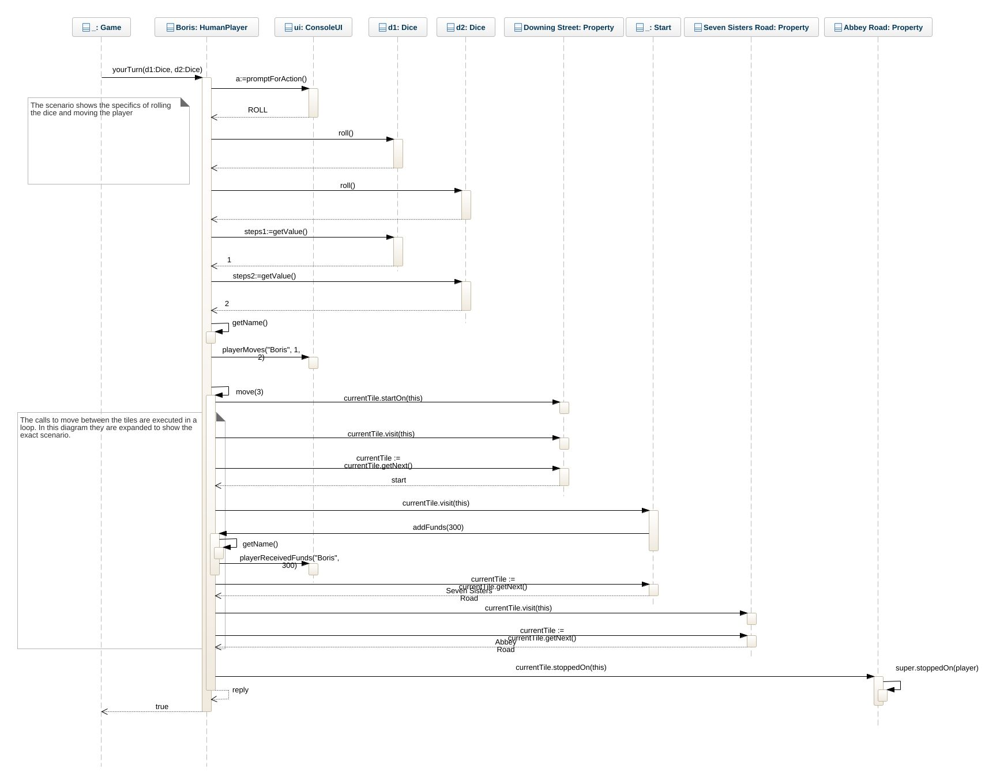

Task 1 - Working with a design and implementation

Automatic Unit tests
To build confidence in that our system works as expected after successfull compilation we can run code that test the classes on our own code. Such test code is called unit tests, often we use some framework that can automatically execute our tests and report back any issues. In such cases we talk about automatic unit tests. We will not go deeper in to this for the assignment other than that you will get a number of unit tests and these should be passing when handing in. Basically you take a look at the first test case, change/add to the implementation so that the test case works (you do not change the test case).
The test are located in app/src/test and usually follows the same package structure as the main source code. Note that this means that test code is located in the same package as the main code (even if they have some parent folder that is not the same). This makes it possible for test code to access anything that is declared as protected and not only public public.
The unit tests are of course executed as part of the automatic pipeline and when build using gradlew.

Study the design available in design.md

Check the test cases in src/test/monopoly/TierOneTests.java

Uncomment one test case, work from the top to the bottom
Run ./gradlew build - test should fail (note that when you have started to make fixes the test case may succeed, and vice versa an old test case may stop working if you introduce some problem in your fixes)
Fix the corresponding implementation. Note that the Tile class should not contain any extra fields, or its constructor need any complex logic as looping or if statements to work. Use object diagram sketches to figure out how the links between the objects need to change.
Run ./gradlew build - repeat from 3 as long as the test fails
commit, push
If there are more test cases left goto 3
Run the game and make sure it is playable. You can probably use your IDE to start the game, or alternatively use gradle: ./gradlew run -q --console=plain

You are done for the passing grade and can run/play the game (this can be done all the time but there will be a null pointer exception until the first Tile constructor is fixed, this is the first test case).

Higher Grade Tasks
For higher grades you need to add a computer "AI" player.

Implement at least one Computer player, avoid code duplication and use the existing design. The computer player does not need to be smart in any way, it can act on random (you can even have several types of players and then pit them against each other)
Make sure the game is playable.
Update the class diagram with the changes save as img/updated_class_diagram.jpg

Update design.md to show this new class diagram.

Notes
Depending on IDE you may be able to run the test cases directly in the IDE, but make sure everything works by using ./gradlew build as often as possible.
You can download the monopoly model xml and use that as a base for the higer grade changes. Possibly your tool allows you to import it.

Download oop_monopoly.xmi file from GitLab
Press New Project on GenMyModel
Press UML on Project Selection
Press middle option "Import XMI"
Choose file.
Put a valid project name.
Make sure visibility on project is private.
Import
Access it

Task 2 - Reflecting on Initial Design
The final step of the assignment is to reflect on your intended design from assignment 2 and compare it with the working design presented in this assignment.
You work on the report in the main branch. Your report should be structured as a markdown formatted file called report.md located in the report folder. Feel free to use the intended design images or make new ones if needed. You should reflect on the following:

Are there any classes missing in your design, why/why not?
Did you have any extra classes in your design, why/why not?
Are there differences in naming the classes? How should classes be named?
Are there differences in the relations between the classes?
Did you connect the objects using dependency/association or did you use id-connections?
Did you manage to divide the complexity/behaviour into different classes or do you have one central class having most of the code?
What differences are there for the object diagram?
What differences are there for the sequence diagram?
Do you think you made a good job in your initial design, why/why not?
What is the most important thing you learned by designing first?

The text should be argumentative/reasoning/flowing, i.e it is more than just answering the questions above and not a simple list of answers. Feel free to use references to litterature to support your arguments.

# Monopoly-Game
# Monopoly Game OO-Design
This document describes the design according to the requirements presented in assignment2. The overall goal was to prepare for a computer player, and to spread the complexity/behavior over multiple classes to not end up with a central class that does everything.

## Overview
The following describes the most central classes in the design and their responsibilities. These are the classes that contain most of the behavior i.e. the rules of the game.

### Game
Responsible for creating the board, dice, ui, and players. It also runs the main game loop, and handles the game rounds with the rule to that the player must roll again if dice have an equal score.

### HumanPlayer
Represents a human player and uses the ui to prompt for actions etc. Contains the rules for moving itself over the tiles, and handling its own funds. Extends the Player interface, to prepare for a computer player alternative, although it is likely that some of the functionality from HumanPlayer is also needed in a computer player.

### Tile Hierarchy
Tiles are structured as a circular doubly linked list where each tile links to the next and previous tile.
A tile gets different messages when a player object stars, passes over or stops at the tile. In that way different behaviors can be triggered.
Tile subclasses are responsible for their specific rules when a player, starts, stops or moves over a tile. Property tiles encapsulate the rules for buying a property and paying rent for it. Start tile is responsible for handing out funds when passed. More types of tiles could be created in this way.

## Future Improvements to Consider
 * Consider a messaging interface for the ConsoleUI to extend. For example the HumanPlayer class does not really need to know about the whole ConsoleUI. It would also make for a more adaptive design where the UI could ultimately be changed to something else.
 * In the Player class the operations payRent and deduceFunds are doing almost the same thing (there are some differences). Possibly deduceFunds could be have some parameters and we could live without a separate payRent operation.
 * If the introduction of a computer player results in code duplication from HumanPlayer, consider adding an abstract base class e.g. PlayerBase and consolidate common behavior in this.
 * Tile hierarchy could be in its own package
 * Tile hierarchy could be extended with more subclasses to represent other types of tiles (Jail, Card tiles etc)

## Class diagram

## Move Player Boris Scenario
Corresponds to the scenario in the assignment description.

### Initial state object diagram
Shows relevant objects for the initial state of the scenario

### Sequence Diagram
Shows the exact calls made to execute the sequence diagram. Note that in the implementation there is more flexibility (e.g. if statement to handle other choices and loops to handle variable number of steps). In this diagram we focus on the exact scenario as described.

## Property Buy
### Sequence Diagram
Show the exact calls that should be made to implement the Property.buy operation.

